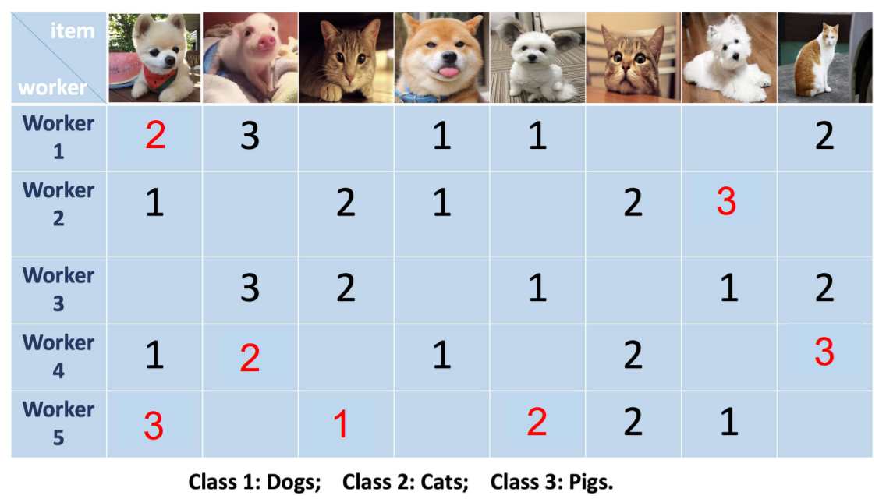
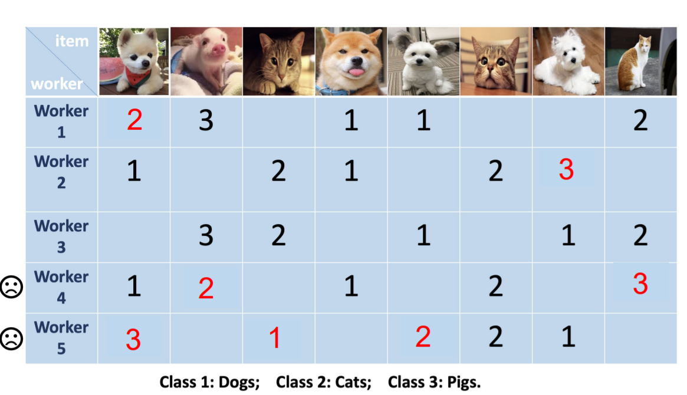
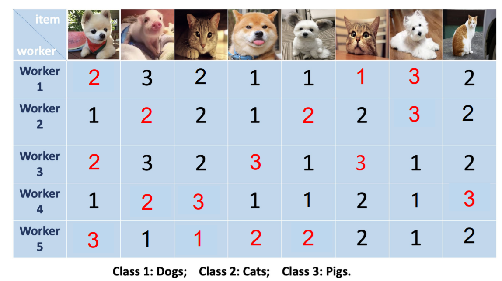
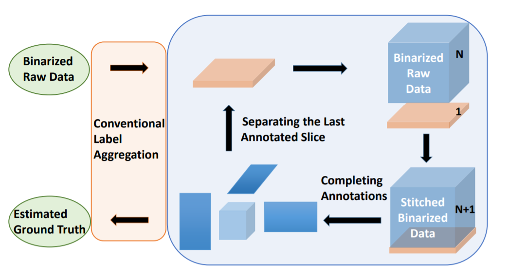

# MiSC: Mixed Strategies Crowdsourcing ([Link](https://www.ijcai.org/proceedings/2019/193)).


## Methodology

### Crowdsoring Task
Acquiring label data from domain experts or well-trained workers is usually **expensive** and **time-consuming**. Obtaining label data from crowd workers is usually **cheap** and **easy**. However, some of the data can be **unreliable**.

We use pictures from dogs, cats, and pigs as an example. If we invite crowd workers to label the pictures, they may give wrong or empty labels. The goal of crowdsourcing task is to **infer the true labels** from a large sum of noisy labels.



### Idea
The existing approaches of crowdsourcing task can be divided into two categories, namely, label aggregation benchmark algorithm and tensor completion algorithm.

#### Label Aggregation Benchmark Algorithm
| Aabbreviation | Full Name |
|:----:|:------:|
| **MV** | Majority Voting |
| **DS-EM** | Dawid-Skene model + Expectation Maximization |
| **DS-MF** | Dawid-Skene model + Mean Field |
| **MMCE(C)** | Categorical Minimax Conditional Entropy |
| **MMCE(O)** | Ordinal Minimax Conditional Entropy |

Algorithms belong to this category aims to delete labels given by unreliable workers. For example, in the cute example, labels given by worker 4 and 5 will be discarded.



#### Tensor Completion Algorithm
| Method | Paper |
|:---:|:---:|
| **LRTC** | [Liu et al., 2013](https://repository.kaust.edu.sa/bitstream/handle/10754/562566/2012.PAMI.JiLiu.Tensor%20Completion.pdf?sequence=1) |
| **TenALS** | [Jain and Oh, 2014](https://arxiv.org/pdf/1406.2784.pdf) |
| **Tucker** | [Tucker, 1966](https://www.bibsonomy.org/bibtex/1e6c2d14ddb42cb2012afaeb8ab1d19aa/threemode), [De Lathauwer et al.](https://old-www.sandia.gov/~tgkolda/tdw2004/ldl-94-31.pdf) |

Tensor completion algorims aim to fill the empty labels. 




### Motivation

Our idea is to combine the two categories together, which can form a versatile complete-aggregate two-step looping structure.

### Work Flow




## Citation
If you find MiSC useful in your research, please consider citing:
```
@article{ko2019misc,
  title={Misc: Mixed strategies crowdsourcing},
  author={Ko, Ching-Yun and Lin, Rui and Li, Shu and Wong, Ngai},
  journal={arXiv preprint arXiv:1905.07394},
  year={2019}
}
```

## Runing Codes
Our codes are implemented in MATLAB. We organize the codes according to different datasets, and provide the datasets we use in our experiments. To run the codes, the users need to switch to the corresponding dataset folder and select a tensor completion algorithm. The output will contain the estimation error of the MiSC approach based on the selected tensor completion algorithm with the abovementioned label aggregation benchmark algorithm.

It is worth noting that when implementing MiSC to your own dataset, the hyper-parameters may change accordingly.

## Experimental Results
The following tables show estimation errors (%) of pure and mixed strategies on Web, BM, RTE, Dog, Temp, and Bluebirds datasets. Nonzeros rates and annotation error rates of datasets are given after their names (·%/·%). As an example, the lowest estimation error in the Web dataset comes from the low-rank Tucker completion + MMCE(O) aggregation strategies.

### Web

| Web(3.3/63.4) | MV | DS-EM | DS-MF | MMCE(C) | MMCE(O) |
|:--------:|:--------:|:--------:|:--------:|:--------:|:--------:|
| **pure** | 26.93 | 16.92 | 16.10 | 11.12 | 10.33 |
| **LRTC** | 26.76 | 16.55 | 16.09 | 11.12 | 10.33 |
| **TenALS** | 26.93 | 16.77 | 15.83 | 11.12 | 10.33 |
| **Tucker** | 10.87 | 5.77 | 5.73 | 6.97 | **5.24** |

### BM

| BM(6.0/31.1) | MV | DS-EM | DS-MF | MMCE(C) | MMCE(O) |
|:--------:|:--------:|:--------:|:--------:|:--------:|:--------:|
| **pure** | 30.4 | 27.60 | 26.90 | 27.10 | 27.10 |
| **LRTC** | 29.25 | 27.60 | 26.90 | 27.10 | 27.10 |
| **TenALS** | 27.60 | 27.60 | 26.90 | 27.10 | 27.10 |
| **Tucker** | 26.50 | 27.00 | **26.20** | 26.40 | 26.40 |

### RTE

| BM(6.0/31.1) | MV | DS-EM | DS-MF | MMCE(C) | MMCE(O) |
|:--------:|:--------:|:--------:|:--------:|:--------:|:--------:|
| **pure** | 10.31 | 7.25 | 7.13 | 7.50 | 7.50 |
| **LRTC** | 9.25 | 7.25 | 7.00 | 7.50 | 7.50 |
| **TenALS** | 10.25 | 7.25 | 7.13 | 7.50 | 7.50 |
| **Tucker** | 8.38 | 6.88 | **6.75** | 7.50 | 7.50 |

### Dog

| BM(6.0/31.1) | MV | DS-EM | DS-MF | MMCE(C) | MMCE(O) |
|:--------:|:--------:|:--------:|:--------:|:--------:|:--------:|
| **pure** | 17.78 | 15.86 | 15.61 | 16.23 | 16.73 |
| **LRTC** | 15.61 | 15.61 | 15.61 | 15.61 | 15.61 |
| **TenALS** | 15.86 | 15.74 | 15.61 | 15.86 | 15.86 |
| **Tucker** | 15.61 | 15.49 | **15.37** | 15.86 | 15.86 |

### Temp

| BM(6.0/31.1) | MV | DS-EM | DS-MF | MMCE(C) | MMCE(O) |
|:--------:|:--------:|:--------:|:--------:|:--------:|:--------:|
| **pure** | 6.39 | 5.84 | 5.84 | 5.63 | 5.63 |
| **LRTC** | 5.19 | 5.63 | 5.63 | 5.63 | 5.63 |
| **TenALS** | 5.41 | 5.63 | 5.84 | 5.63 | 5.63 |
| **Tucker** | 5.19 | **4.98** | **4.98** | 5.41 | 5.41 |

### Bluebirds

| BM(6.0/31.1) | MV | DS-EM | DS-MF | MMCE(C) | MMCE(O) |
|:--------:|:--------:|:--------:|:--------:|:--------:|:--------:|
| **pure** | 24.07 | 10.19 | 10.19 | 8.33 | 8.33 |
| **LRTC** | 20.37 | 9.26 | 9.26 | 6.48 | 6.48 |
| **TenALS** | 23.15 | 9.26 | 9.26 | 6.48 | 6.48 |
| **Tucker** | 19.91 | 8.33 | 9.26 | **4.63** | **4.63** |

## License

MiSC is released under MIT License.
